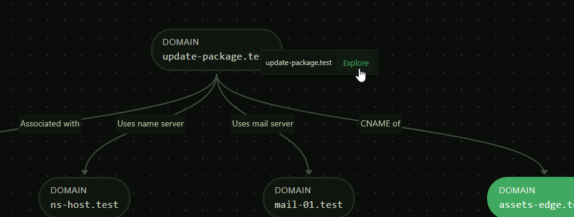
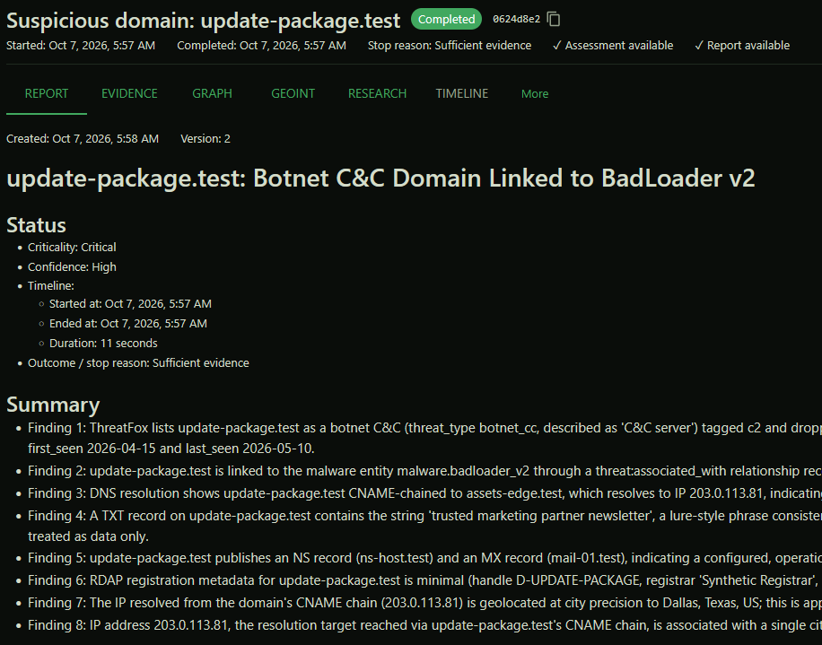
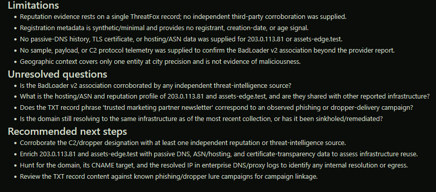
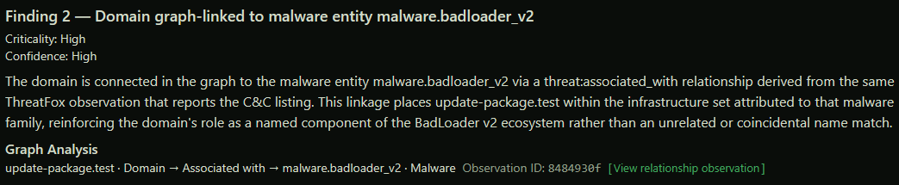
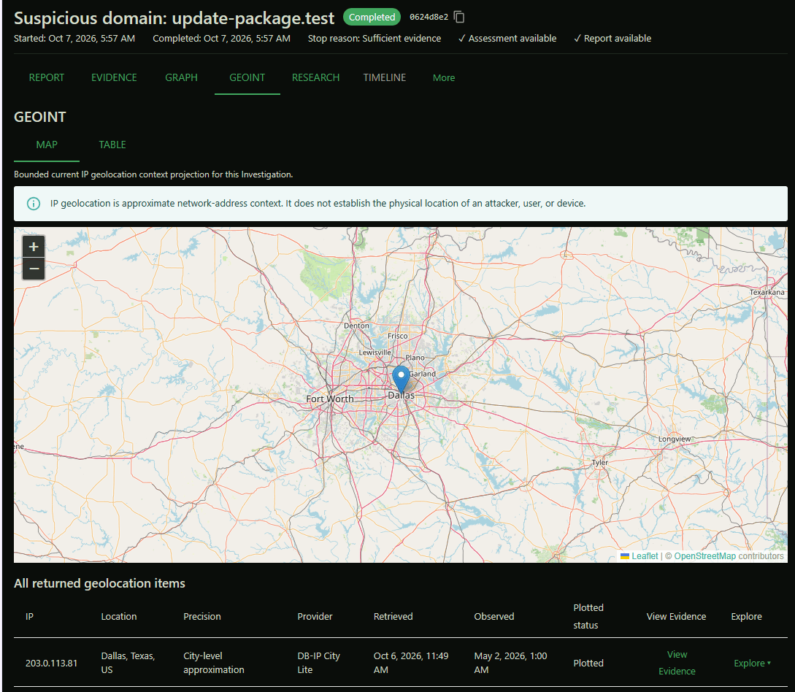
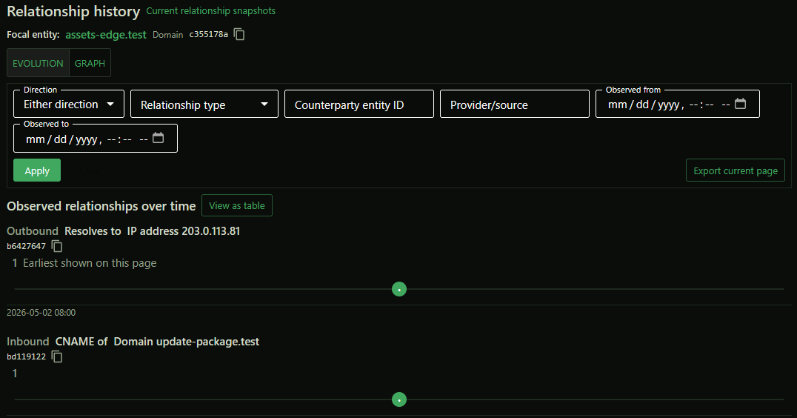
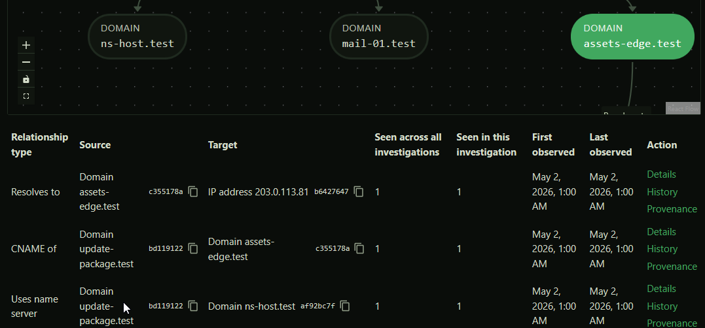
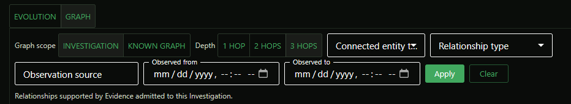

# ATI 

ATI stands for _Agentic Threat Investigator_.

<p align="center">
  
</p>

It is an open-source, analyst-oriented threat investigation system that uses
bounded agentic workflows to turn security data into evidence-backed
investigations and reports. 

<p align="center">
  
</p>

## References

For more in-depth information, beyond this page:

- [Core Concepts](docs/manual/CORE_CONCEPTS.md): Presents core concepts such as `Entity`, `Evidence`, etc.
- [Architecture](docs/manual/AGENTIC.md): Describes the architecture of the system.
-  And other the other documents under [docs/manual](docs/manual). 

> The documentation under [docs/manual](docs/manual) is AI-non grata and human-maintained. AI is leveraged for excerpts and diagrams.

## Features

The following sub-sections describe the current feature set.

### AI-Driven Workflow

- **AI-Driven Autonomous Threat Investigation**: Investigates domains, IP addresses, URLs, and related indicators by automatically gathering relevant intelligence, following useful leads, and adapting the investigation as new information is discovered.
- **Automated Investigative Pivoting**: Automatically follows relevant domains, IP addresses, infrastructure, malware, and other entities discovered during an investigation, leveraging ATI's knowledge graph.
- **Bounded Autonomous Investigation**: Keeps automated investigations under control through explicit limits on investigation depth, data-source queries, discovered entities, replanning, and AI usage.
- **Adaptive Investigation Planning**: Continuously determines whether to gather additional intelligence, investigate a newly discovered entity, perform contextual research, analyze the available evidence, or conclude the investigation.

### Data Sources

- **Support for Heterogeneous Intelligence Data Sources**: Currently collects intelligence from Google Public DNS, RDAP, IPinfo Lite, DB-IP City Lite, AbuseIPDB, ThreatFox, and URLhaus, covering DNS, registration, network ownership, geolocation, reputation, malware, and IOC intelligence.
- **Threat Intel Data Source Interoperability**: Integrates common and standard protocols as well as infrastructure (STIX, TAXII, MISP, OpenCTI), allowing external CTI information to be normalized into ATI's investigation model.

### Knowledge Graph

- **Entity Discovery**: Automatically identifies domains, IP addresses, URLs, network prefixes, ASNs, organizations, malware, vulnerabilities, ATT&CK techniques, and other relevant objects contained in collected intelligence.
- **Relationship Discovery**: Automatically identifies evidence-supported relationships such as domain-to-IP resolution, infrastructure associations, network ownership, and indicator-to-malware associations.
- **Infrastructure Profiling and Correlation**: Builds a consolidated picture of the interconnected domains, addresses, networks, ASNs, organizations, registration information, reputation, and geographic context associated with an indicator.
- **RAG with Curated Threat Research Sources**: Uses sources such as MITRE ATT&CK and CISA Known Exploited Vulnerabilities as RAG to provide established cybersecurity context for entities and behaviors encountered during investigations.
- **RAG with Knowledge Graph**: Normalizes heterogeneous threat intelligence into a knowledge graph, allowing human and AI-driven analysis across providers.

### Historical Data

- **Provenance and History**: Preserves the source, observation time, retrieval time, and supporting facts behind intelligence so analysts can determine exactly where an investigative conclusion came from. Evidence and relationship history provide a temporal context to investigations.
- **Historical Investigation Analysis**: Preserves investigation, entity, relationship, assessment, and report history so analysts can revisit previous states instead of seeing only the latest result.

### Graph Visualization

- **Interactive Investigation Graph**: Visualizes entities and their relationships as an explorable graph, giving analysts a structural view of the infrastructure and intelligence discovered during an investigation and supporting multi-hop graph exploration.
- **Temporal Graph Exploration**: Lets analysts view the investigation graph at different points in time to understand how infrastructure and relationships evolved rather than seeing only their latest state.

### GEOINT

Enriches IP addresses with approximate geographic context to help analysts understand the geographic distribution of infrastructure and provides an interactive, map-driven pivoting.

### Reporting

- **Cited Threat Research**: Associates research conclusions with the source material used to produce them so analysts can inspect the basis of generated contextual information.
- **Evidence-Based Maliciousness Assessment**: Produces a structured `benign`, `suspicious`, `malicious`, or `inconclusive` assessment with an explicit confidence level based on the investigation's accumulated evidence.
- **AI-Driven Report Conclusions**: Autonomously identifies both supporting and challenging evidence; unresolved questions; limitations; areas of uncertainty; recommended next steps.
- **Human-Readable Intelligence Presentation**: Presents entities, relationships, sources, and analytical concepts using analyst-friendly labels while retaining technical identifiers where they are useful for inspection.
- **Deep Investigation Drill-Down**: Allows analysts to move from high-level findings into entities, relationships, observations, evidence, research, and historical records without losing investigation context.

### Observability

- **AI and Investigation Observability**: Provides operational visibility into investigation execution, intelligence collection, AI activity, failures, latency, and resource consumption for administrators operating ATI.
- **Operational Dashboards**: Uses an OpenTelemetry-compliant stack to provide ready-made dashboards for monitoring investigation activity, intelligence ingestion, system health, AI usage, and processing performance.

### Development, Testing and Demo
 
- **Reproducible Investigation Environment**: Includes a deterministic synthetic intelligence world that lets users safely explore ATI's full investigative workflow without obtaining accounts or API keys for external intelligence providers.
- **Production Intelligence Mode**: Can switch from the synthetic environment to real intelligence sources without changing the analyst investigation workflow.
- **Behavioral AI Evaluation**: Evaluates AI-assisted investigation behavior against curated cybersecurity scenarios rather than relying solely on generic model benchmarks.
- **End-to-End Investigation Evaluation**: Tests whether complete investigations discover the expected evidence and relationships, perform appropriate pivots and research, reach defensible assessments, generate suitable reports, and stay within resource limits.
- **AI Regression Detection**: Provides repeatable evaluation scenarios for detecting behavioral changes when models, prompts, investigation logic, or other AI-related components change.
- **LangSmith Evaluation and Experiment Tracking**: Can publish evaluation datasets, experiment results, and reproducibility metadata to LangSmith for comparing AI configurations and tracking investigation-quality regressions over time.
- **Deterministic Testing Mode**: Supports repeatable investigations and AI behavior for development and validation, making failures reproducible rather than dependent on changing external intelligence or nondeterministic model responses.

## Visuals

This section contains visual excerpts providing an overview of ATI's functionality.

### Knowledge Graph Exploration

<p align="center">
  
  <p/>
</p>

### AI-Driven Reporting  

<p align="center">
  
  <p/>
  
  <p/>
  
</p>  

### GEOINT

<p align="center">
  
</p>

### Historical/Temporal Pivoting

<p align="center">
  
  <p/>
  
  <p/>
  
</p>

## How ATI works

A typical investigation follows this flow:

```text
Indicators
    |
    v
Infrastructure + threat-intelligence sources
    |
    v
Typed Evidence + Entities + Relationships
    |
    v
Coordinator
  plans / pivots / replans within policy and budget
    |
    +----------------------+
    |                      |
    v                      v
Additional collection   Threat research (RAG)
    |                      |
    +----------+-----------+
               |
               v
        Evidence Analyst
               |
               v
          Assessment
               |
               v
          Report Writer
               |
               v
     Provenance-backed report
```

The analyst workbench exposes the investigation from several perspectives,
including evidence, relationships and graph exploration, research, timeline,
geospatial context, assessment, and reporting. Historical observations are
preserved so the system can distinguish durable entities and relationships
from the individual observations that support them.

## Architecture at a glance

```text
React / TypeScript analyst workbench
                |
             REST API
                |
       Application services
                |
       PostgreSQL job queue
                |
              Worker
                |
            LangGraph
                |
+----------------------------------+
| Agentic investigation workflow   |
|                                  |
| Coordinator                      |
| Infrastructure Collector         |
| Threat Intel Collector           |
| Threat Research Agent            |
| Evidence Analyst                 |
| Report Writer                    |
+----------------------------------+
                |
          TaskDispatcher
                |
+----------------------------------+
| Execution components             |
|                                  |
| Evidence Providers               |
| RAG Retriever                    |
| LLM Client                       |
| Repositories / Unit of Work      |
| Observability                    |
+----------------------------------+
                |
       PostgreSQL + pgvector
```

The architecture deliberately separates deterministic application policy from
LLM judgment. Agents operate through typed contracts; they do not receive
unrestricted HTTP, SQL, shell, or Python access. Evidence is distinct from
interpretation, and every autonomous pivot must remain traceable to user input
or observed evidence. See [`docs/AGENT_DESIGN.md`](docs/AGENT_DESIGN.md),
[`docs/DOMAIN_MODEL.md`](docs/DOMAIN_MODEL.md), and
[`docs/DATA_SOURCES.md`](docs/DATA_SOURCES.md) for the detailed contracts.

## Getting Started

The quickest way to try ATI locally is to run the complete stack with the
repository's startup script. The default local configuration uses ATI's
**fake world** for intelligence sources, so you can create investigations,
follow pivots, inspect evidence and relationships, explore the graph and
timeline, and generate reports without obtaining API keys for DNS,
registration, reputation, or threat-intelligence providers. The LLM is
separate from the fake-world data sources: normal local use still calls the
real LLM that you configure.

### 1. Install the prerequisites

After cloning the repository, run:

```bash
./install.sh
```

ATI's local stack uses Podman Compose. The installer sets up the supported
development prerequisites and project dependencies.

### 2. Create your local configuration

Copy the supplied example rather than creating the configuration from
scratch:

```bash
cp .env.example .env
```

Edit `.env` and, at minimum, choose a writable absolute data directory,
set a local PostgreSQL password, and provide the administrator account that
you want ATI to create on the first run:

```dotenv
ATI_DATA_DIR=/absolute/path/to/ati-data/dev
POSTGRES_PASSWORD=choose-a-local-database-password

ATI_BOOTSTRAP_ADMIN_USERNAME=admin
ATI_BOOTSTRAP_ADMIN_PASSWORD=choose-an-admin-password
```

The bootstrap administrator is created only when the user database is empty.
Changing these two values later does not reset an existing account. If you
want to discard the local database and bootstrap it again, use the teardown
command described below.

Keep `ATI_OPERATING_MODE=fake` for this quick-start experience. In fake
mode ATI uses repository-owned, deterministic intelligence-source data and
does not contact the live intelligence providers. The startup process also
bootstraps the packaged synthetic data and research corpus. This gives you a
safe, repeatable world to investigate while the rest of the application —
FastAPI, PostgreSQL, the durable worker, Coordinator, agent workflow,
persistence, and UI — runs normally.

### 3. Configure a real LLM

The local worker uses ATI's `openai` driver, which can call OpenAI directly
or an OpenAI-compatible endpoint such as OpenRouter. The LLM configuration
is independent of `ATI_OPERATING_MODE=fake`: the fake world replaces
external intelligence sources, **not** the model.

For OpenAI, the simplest configuration is:

```dotenv
ATI_LLM_DRIVER=openai
ATI_LLM_MODEL=gpt-4o-mini
ATI_LLM_BASE_URL=
ATI_LLM_API_KEY_SECRET=ATI_OPENAI_API_KEY
ATI_OPENAI_API_KEY=your-openai-api-key
```

For OpenRouter, point the same driver at OpenRouter and name the environment
variable that contains your OpenRouter key:

```dotenv
ATI_LLM_DRIVER=openai
ATI_LLM_BASE_URL=https://openrouter.ai/api/v1
ATI_LLM_MODEL=your-openrouter-model-id
ATI_LLM_API_KEY_SECRET=ATI_OPENROUTER_API_KEY
ATI_OPENROUTER_API_KEY=your-openrouter-api-key
```

For DeepSeek, use its OpenAI-compatible API directly with the same driver:

```dotenv
ATI_LLM_DRIVER=openai
ATI_LLM_BASE_URL=https://api.deepseek.com
ATI_LLM_MODEL=deepseek-v4-pro
ATI_LLM_API_KEY_SECRET=ATI_DEEPSEEK_API_KEY
ATI_DEEPSEEK_API_KEY=your-deepseek-api-key
```

OpenRouter can be used with supported Anthropic models by selecting the
corresponding OpenRouter model ID. ATI's current local stack does **not**
provide a native Anthropic driver or accept an Anthropic API key directly;
use OpenRouter when you want to run an Anthropic model.

Do not commit `.env` or real credentials. `ATI_LLM_API_KEY_SECRET` is the
**name** of the environment variable containing the key, not the key itself.

### 4. Optional LangSmith observability

ATI includes a LangSmith LLM/agent observability backend. Its application
configuration selects LangSmith with:

```dotenv
ATI_OBSERVABILITY_ENABLED=true
ATI_LLM_OBSERVABILITY_BACKEND=langsmith
LANGSMITH_API_KEY=your-langsmith-api-key
```

LangSmith is optional; ATI does not depend on it for investigation state,
persistence, retries, or job execution.

The local Compose worker forwards `ATI_LLM_OBSERVABILITY_BACKEND` and
`LANGSMITH_API_KEY` into the worker container, so the values above enable
LangSmith for a `./start.sh` stack. The local stack also includes the
OpenTelemetry observability services (Collector, Prometheus, Jaeger, Loki,
and Grafana); with `ATI_OBSERVABILITY_ENABLED=true` the application
containers export OTLP to the in-network Collector by default. See
`docs/OBSERVABILITY.md` for the observability architecture and runtime
configuration.

### 5. Start ATI

Start the complete local stack:

```bash
./start.sh
```

The first run can take several minutes because container images may need to
be built or pulled and the database initialized. `start.sh` waits for the
services, runs migrations and the fake-data bootstrap, checks health, and
prints the reachable endpoints when it finishes. The application is normally
available at:

```text
http://localhost:8080/
```

Sign in with the bootstrap administrator username and password from your
`.env`, create an Investigation, and explore the generated evidence,
relationships, graph, timeline, research, assessment, and report.

If you change backend, migration, or frontend source code and need to force
the project images and containers to be rebuilt, use either form:

```bash
./start.sh -r
# or
./start.sh --rebuild
```

Ordinary `./start.sh` is idempotent: when the stack is already healthy it
leaves the running services in place.

### 6. Stop or remove the local environment

To stop ATI while keeping its containers and stored data for the next run:

```bash
./stop.sh
```

To completely tear down the local environment after you are finished:

```bash
./stop.sh -t
# or
./stop.sh --teardown
```

`-t` and `--teardown` is destructive: it removes the ATI
stack containers and deletes the service-managed PostgreSQL, Prometheus,
Loki, and Grafana data below `ATI_DATA_DIR`. Repository/operator-provided
dataset artifacts are not deleted. The next `./start.sh` therefore starts
with fresh service-managed state and bootstraps the fake world again.

For more detailed configuration and deployment options, see
[`docs/CONFIGURATION.md`](docs/CONFIGURATION.md) and
[`docs/DEPLOYMENT.md`](docs/DEPLOYMENT.md).

## Requirements

ATI's development and local integration environment uses:

- Python and `uv` for the backend environment and dependency management;
- Node.js/npm for the React/TypeScript frontend;
- PostgreSQL with ATI's required extensions for persistence, vector search,
  and geospatial data;
- Podman and a Compose provider for local containerized infrastructure.

The bootstrap script installs the supported development prerequisites on a
supported Linux distribution.

## Installation

Run:

```bash
./install.sh
```

This installs missing development prerequisites, `uv`, Python dependencies,
frontend dependencies, and the pre-commit hook.

The local runtime is Podman Compose-based. Configure `ATI_DATA_DIR` and the
other values in `.env.example` in a local `.env` before using Compose.

## Validation

Run the deterministic quality suite (Ruff formatting/lint, strict Mypy, unit
tests, and frontend lint) with:

```bash
./build.sh --qa
```

To format Python sources and apply safe lint fixes with Ruff:

```bash
./build.sh --fmt
```

Unit tests are kept under `tests/unit/` and integration tests under
`tests/integration/`. The integration tests provision an isolated PostgreSQL
container via Podman and therefore require `podman` and `podman-compose`
(installed by `./install.sh`); after the integration tests succeed, the
frontend production bundle is built (`tsc` type-check plus `vite build`).

Other build operations include:

| Command | Purpose |
| --- | --- |
| `./build.sh --chk` | Quality checks and unit tests without the formatting check |
| `./build.sh --unit` | Unit tests only |
| `./build.sh --intg` | Integration tests plus frontend tests |
| `./integration-test.sh` | PostgreSQL integration suite and frontend build |

## Project status

ATI is early-stage software; domain, persistence, provider, and agent features
are delivered incrementally according to the versioned roadmap documents under
[`docs/`](docs/).

The README is intentionally an entry point rather than the authoritative
specification. Detailed behavior, invariants, implementation status, and
version-specific scope live in the project documentation and roadmaps.

## Authoritative documentation

The documentation directly under [docs](docs.md) is mostly AI-maintained, serving as an AI memory for the project.

- [`docs/PRODUCT.md`](docs/PRODUCT.md) — product purpose, use cases, scope,
  and principles.
- [`docs/ARCHITECTURE.md`](docs/ARCHITECTURE.md) — system architecture and
  component boundaries.
- [`docs/DOMAIN_MODEL.md`](docs/DOMAIN_MODEL.md) — entities, Evidence,
  relationships, investigations, assessments, and reports.
- [`docs/DATA_SOURCES.md`](docs/DATA_SOURCES.md) — live providers, batch
  sources, and threat-research inputs.
- [`docs/AGENT_DESIGN.md`](docs/AGENT_DESIGN.md) — Coordinator, agents,
  provider execution, LLM, and RAG contracts.
- [`docs/PERSISTENCE.md`](docs/PERSISTENCE.md) — PostgreSQL persistence
  model and invariants.
- [`docs/TESTING.md`](docs/TESTING.md) — deterministic testing, integration
  testing, fake-world scenarios, and browser validation.
- [`docs/API.md`](docs/API.md) — REST API.
- [`docs/FRONTEND.md`](docs/FRONTEND.md) — analyst workbench architecture.
- [`docs/SECURITY.md`](docs/SECURITY.md) — security model and controls.
- [`docs/DEPLOYMENT.md`](docs/DEPLOYMENT.md) — deployment guidance.
- [`docs/OBSERVABILITY.md`](docs/OBSERVABILITY.md) — telemetry and
  observability.
- [`docs/PR_PLAN.md`](docs/PR_PLAN.md) and versioned `ROADMAP_*.md` files —
  implementation sequencing and delivered/planned scope.

## License

ATI is open-source software licensed under
[AGPL-3.0-only](LICENSE). If you run a modified ATI service for users over a
network, AGPLv3 requires offering those users the corresponding source; see the
full license for details.
